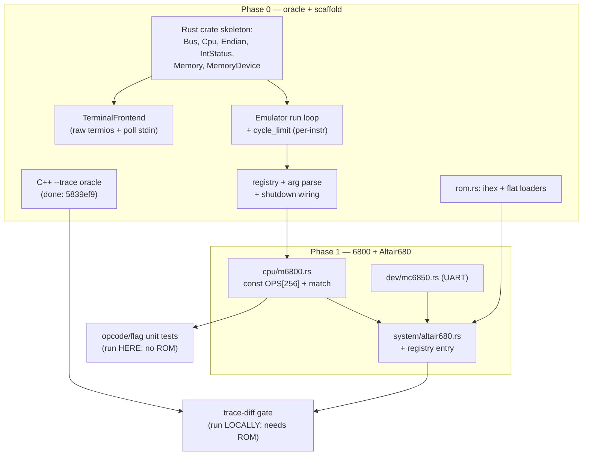

# Plan: Port the vintage-computer emulator from C++ to Rust

## Status (updated after Phase 3)

Three of the four machines are ported and validated against the C++ oracle. ~7,200 lines of Rust,
87 tests, clippy clean.

| Phase | Scope | State |
|---|---|---|
| 0 | C++ `--trace` oracle, crate scaffold, run loop, terminal frontend, registry, `rom.rs` | ✅ `5839ef9`, `38d6735` |
| 1 | 6800 + Altair680 + MC6850 | ✅ `38d6735`, `fbf7ee4` |
| 2 | 6809 + System09 + Intel HEX | ✅ `bb4cd4e`, `89b1024` |
| 3 | Z80 + RC2014 | ✅ `7143966`, `2e88ed8`, `934cb9f` |
| 4 | Kaypro + SDL2 + WD1793 + Z80Sio + video | ⬜ not started — **the next session** |
| 5 | Delete the C++ tree and `libihex`; docs and CI for Cargo | ⬜ blocked on Phase 4 |

Validation standing today, all against the C++ `--trace` oracle:

| Core | Real-ROM boot | Opcode coverage | Extra |
|---|---|---|---|
| 6800 | 99,999 instructions, identical | every value, 256 cases | 17 snippet/boot diffs |
| 6809 | 49,999 instructions, identical | every value of all 3 pages | passes the e2e BASIC regression |
| Z80 | 5,000,000 instructions, identical | every value of 9 pages, 2,304 cases | 2 mutations confirmed caught |

Still open, in priority order:

1. **Phase 4 (Kaypro)** — the only unported machine, and the only one needing SDL2.
2. **`6809-obc`** needs `uart16550`; the subsystem is currently rejected with an explicit error.
3. **RC2014 can't transmit** — a pre-existing C++ defect the port reproduces rather than fixes. See
   "Known defects reproduced, not fixed" below.
4. **CLI parity gap:** `parse_args` accepts only the separated forms (`-l 100`), not `getopt_long`'s
   `--limit=100` / `-l100` / unambiguous prefixes. Nothing in the repo uses those forms.

## Context

This repo is a ~9,000-line C++17 terminal emulator for four vintage machines (Altair 680/6800,
System09/6809, RC2014/Z80, Kaypro II/Z80+SDL). The goal is a full Rust rewrite whose object model is
built for expansion: easy to add CPUs and systems, tolerant of 8/16/32-bit buses, able to model CPUs
with or without interrupts, and with a threading model that is correct by construction. The current
C++ design is a reasonable starting point but has a Rust-hostile shape and several confirmed defects
(verified by reading the code):

- **Ownership cycle:** `System` owns `Cpu` via `unique_ptr` while `Cpu` holds a `System &`
  back-reference (`cpu/cpu.h:30,40`) — an aliasing cycle Rust's borrow checker forbids.
- **Global cycle limit:** `int64_t g_cycle_limit` (`main.cpp:37`) is re-`extern`'d inside each core's
  run loop (`cpuz80.cpp:356`, `cpu6809.cpp:627`, `cpu6800.cpp:552`). It decrements **once per
  instruction** (`cpuz80.cpp:365`), not per clock cycle — semantics to preserve exactly.
- **RC2014 heap OOB — fixed in C++ (`1e7005d`):** for `addr >= 0x8000` the decode returned offset
  `0x8000` (`system_rc2014.cpp:246`), and the read/write did `ReadByte(address + offset)`
  (`system_rc2014.cpp:143,157`) → indices `0x10000..0x17fff` on a **64 KB** buffer
  (`mMem->Alloc(64*1024)`, `system_rc2014.cpp:87`). Confirmed via ASan (heap-buffer-overflow before
  the fix, clean after). Fixed by changing the offset to `0` (RAM occupies the top half of the 64 KB
  buffer directly).
- **Unsynchronized Kaypro video race — fixed in C++ (`043e199`):** the CPU thread wrote `mVideoMem`
  and set a plain-`bool` `mNeedsRefresh` (`system_kaypro.cpp:205-206`, `console_sdl.h:24`) while the
  SDL main thread read both with no synchronization (`console_sdl.cpp:80`, render callback read
  `mVideoMem` directly at `system_kaypro.cpp:223`). Fixed with a `std::mutex` guarding all `mVideoMem`
  access and `std::atomic<bool>` for `mNeedsRefresh`/`mQuit` (the latter had the identical
  unsynchronized cross-thread pattern, caught during the same pass).
- **Unsynchronized RC2014 SIO race — fixed in C++ (`753dd4b`):** the console thread wrote
  `mSIORecvByte`/`mSIORecvByte_valid` (`system_rc2014.cpp` `OnConsoleInBufferAdd`) as plain fields
  while the CPU thread read/cleared them in `IORead8` with no synchronization — the identical
  unsynchronized cross-thread pattern as the Kaypro video race, found during a later fact-check pass
  over this plan. Fixed with a `std::mutex` (`mSIOLock`) guarding both fields on both threads.
- **Cycle-limit shutdown hang on terminal systems — fixed in C++ (`774f5da`):** base `Console::Stop()`
  was a no-op (`console.cpp:97-98`), so when a CPU-thread cycle-limit exit called it (`system.cpp:90`),
  the main thread stayed blocked in `getchar()` (`console.cpp:78`) until Ctrl-D. Fixed: `Console::Run()`
  now polls stdin with a timeout and checks a shutdown `atomic<bool>` each iteration. Verified against
  a FIFO stdin held open with no EOF — the process now exits immediately on cycle-limit instead of
  hanging.
- **Interrupts are effectively dead code — in all three cores, not just Z80:** on Z80, nothing calls
  `RaiseIRQ` (`system_rc2014.cpp:128` is a TODO), NMI is never read, IM0/IM2 are stubs
  (`cpuz80.cpp:387-398`). 6800 and 6809 declare exception bitmasks too (NMI/SWI/IRQ for 6800;
  +FIRQ/SWI2/SWI3 for 6809) but their `Run()` loops only ever handle `EXC_RESET` — no core has a
  functioning interrupt-injection mechanism today. Build the Rust shape correctly but do **not** claim
  it as trace-validated for any core. Left as-is — an incomplete feature, not a bug to fix ahead of
  conversion.

**Threading (current C++, for reference):** the CPU runs on a spawned thread (`System::RunThreaded`,
`system.cpp:82`) while the console event loop runs on `main` (`main.cpp:124`). SDL context is created
in the `ConsoleSDL` constructor on the main thread and pumped there. The Rust design keeps this
split.

**Confirmed decisions:** single crate with modules; side-by-side migration gated by per-instruction
trace-diff against the C++ oracle. The four confirmed defects above (RC2014 OOB, terminal hang,
Kaypro video race, RC2014 SIO race) were fixed directly in the C++ tree *before* conversion began
(commits `1e7005d`, `774f5da`, `043e199`, `753dd4b`) rather than deferred to their respective Rust
phases — see "Known-defect fixes" below. The C++ oracle used for trace-diff is now correct, so no
divergence-tolerant matching is needed anywhere in the plan.

## Environment constraint (historical; resolved in the working container)

This plan was originally drafted in a remote container that **could not run the ROM-based gates**: the
`roms` symlink pointed at `/storage/cloud/dropbox/...` (unresolved there) and SDL2 was absent
(`sdl2-config`/`pkg-config sdl2` both missing). That limitation does **not** apply to the working
container this plan is executed from: `roms` resolves cleanly
(`/mnt/nas2/src/svn/emu/roms -> /storage/cloud/dropbox/tech_docs/roms`) and `sdl2-config --version`
reports `2.30.0` — confirmed both by direct check and by exercising it (an SDL-linked build, a
real-ROM RC2014 boot, and `test/run_basic6809_lang_test.sh` passing against the real `BASIC.HEX`).

**Decision:** all gates — unit tests, per-phase trace-diff, the e2e BASIC regression, the ihex
byte-check, and manual boots (including Kaypro's SDL window) — run directly in this container; there's
no need to split work across "build here, validate elsewhere." The makefile's `sdl2-config` usage can
still be made conditional so the oracle builds without SDL, but that's general portability hygiene
(useful for CI or a future environment without SDL2) rather than a requirement for this work to
proceed here.

**Decision:** the first PR still covers **Phase 0 + Phase 1** only. This is now a reviewability
choice — small, independently revertable PRs — not an environment workaround; the C++ tree stays
(Phase 5 deletion deferred) until later phases are validated, which can happen in this same container.

## Target architecture (roadmap for all phases)

### Core traits (`src/bus.rs`, `src/cpu/mod.rs`)

Break the ownership cycle by separating CPU *state* from the *bus* and passing the bus into each step.
The run loop borrows two disjoint fields of one owner — legal in Rust.

```rust
#[derive(Copy, Clone)]
pub enum Endian { Little, Big }

pub struct IntStatus { pub irq: bool, pub nmi: bool, pub vector: u8 } // vector for Z80 IM2

pub trait Bus {
    fn read8(&mut self, addr: u32) -> u8;              // the ONE required primitive
    fn write8(&mut self, addr: u32, val: u8);
    fn io_read8(&mut self, _port: u16) -> u8 { 0 }     // only Z80 systems override
    fn io_write8(&mut self, _port: u16, _val: u8) {}
    // wider accesses default-compose narrow->wide using endian; a native wide-data
    // machine overrides them. Generalizes System::MemRead16 (system.cpp:110-136).
    fn read16(&mut self, addr: u32, e: Endian) -> u16 { /* two read8 */ }
    fn write16(&mut self, addr: u32, val: u16, e: Endian) { /* two write8 */ }
    fn read32(&mut self, addr: u32, e: Endian) -> u32 { /* two read16 */ }
    fn write32(&mut self, addr: u32, val: u32, e: Endian) { /* two write16 */ }
    fn poll_interrupts(&self) -> IntStatus { IntStatus::NONE } // lines live in the machine
}

pub enum StepResult { Ok, Halted, BadOpcode, InfiniteLoop } // maps to today's return codes

pub trait Cpu {
    fn reset(&mut self, bus: &mut dyn Bus);
    fn step(&mut self, bus: &mut dyn Bus) -> StepResult; // exactly one instruction
    fn dump(&self);
}
```

- **Bus-width contract:** address is `u32` (covers 8/16/24/32-bit spaces). Data width = *which*
  accessor a machine implements natively; 8-bit-data machines implement only `read8/write8` and
  inherit the composed wide accessors. Endian is a per-access parameter — the CPU is the authority
  (6800/6809 = Big, Z80 = Little). Caveat: in the C++ cores, stack push/pop (6800's `PUSH16`/`PULL16`
  macros, 6809's equivalents, Z80's `push16`/`pop16`) bypass the endian-typed 16-bit accessor and
  manually compose byte order inline instead — consistent across all three cores today. The Rust port
  should do the same for stack ops rather than assuming the generic `Endian`-parameterized
  `read16`/`write16` covers every 16-bit access path.
- **Interrupts (optional capability):** lines live in the bus (`poll_interrupts`); handling
  (iff1/iff2, im, vectoring) lives in the interrupt-capable CPU's `step`. Forward-looking, **not
  trace-validatable** (C++ mechanism is dead code) — build the shape, don't overclaim.
- **`step()` is new structure, not a rename:** the current C++ `Cpu` base class has no
  single-instruction entry point — each core's `Run()` *is* the whole cycle-limited loop (cycle-limit
  bookkeeping, shutdown check, and the per-instruction body all inlined together; there's no factored
  single-step function to port from). Extracting a `step()`-per-instruction body out of `Run()` is a
  real refactor in every core. Hardest for Z80 (Phase 3), whose `goto restart`/`decode` prefix
  resolution needs restructuring into a loop — though DD/FD/ED/CB resolution already happens within
  one call today (no recursion, no re-entry to the outer loop), so it's a bounded control-flow
  rewrite, not a redesign of the calling convention.

### Ownership & run loop (`src/emulator.rs`)

```rust
pub struct Emulator {
    cpu: Box<dyn Cpu>,
    bus: Box<dyn Bus>,          // Box<dyn Bus>, NOT Box<dyn Machine> — no trait upcast needed
    shutdown: Arc<AtomicBool>,
    cycle_limit: Option<u64>,   // replaces g_cycle_limit; decrement ONCE PER step() (per instruction)
}
```
`run()`: `while !shutdown` → if `cycle_limit` hits 0 break → `cpu.step(&mut *bus)`, mapping
`Halted/BadOpcode/InfiniteLoop` to break; on exit `shutdown.store(true)` to wake the frontend. A
separate `Machine`/factory trait exists only for **construction + metadata** (build the concrete bus,
load ROMs, yield `(Emulator, ConsoleFrontend)`) — not for the run loop.

### Threading model (`src/main.rs`, `src/console/`)

The entire `Emulator` (CPU + bus + devices) is `Send` and **moves onto one spawned CPU thread**. Only
lightweight handles cross the boundary:

| Handle | Direction | Type |
|---|---|---|
| keyboard input | main → CPU | `mpsc::Receiver<u8>` on the CPU-side UART |
| serial/tty output | CPU → main | direct `stdout` lock (or `mpsc` if buffering wanted) |
| shutdown | both | `Arc<AtomicBool>` |
| Kaypro video | CPU → main | `Arc<Mutex<VideoRam>>` + `Arc<AtomicBool>` dirty |

`main()`: parse args → factory builds `(Emulator, ConsoleFrontend)` → `thread::spawn(move ||
emu.run())` → main runs `frontend.run()` → on exit set shutdown, `join`. This **makes the video race
impossible by construction** (the C++ oracle now avoids it too, via an explicit mutex fixed in
`043e199` — Rust's ownership model just makes the equivalent bug unrepresentable rather than
avoidable-with-discipline). Same for keyboard input: the `main → CPU` `mpsc::Receiver<u8>` channel
makes the RC2014 SIO race (also fixed in C++, via a mutex, `753dd4b`) unrepresentable too, rather than
avoidable-with-discipline. The console splits into `ConsoleFrontend` (main thread:
`TerminalFrontend` raw-termios, or `SdlFrontend`) and CPU-thread I/O endpoints (channel receiver +
output sink + Kaypro framebuffer writer).

### SDL2 (`src/console/sdl.rs`, Kaypro — later phase)

Use the `sdl2` crate; its `Sdl`/`EventPump` are `!Send`, so the **compiler enforces** main-thread
confinement. `SdlFrontend` owns window/canvas/font-texture and runs the 60 Hz `poll_iter()` + render
loop. Cross-thread wake on cycle-limit is just an `AtomicBool` checked inside the already-ticking loop
— **no `SDL_PushEvent` hack needed** (`console_sdl.cpp:101-106`). Video: the bus writes the video
region through `Arc<Mutex<VideoRam>>` + sets the dirty flag; the render loop reads under the lock when
dirty (text-mode writes are rare, lock cost negligible).

### Device & registry model

- **Memory-mapped devices** implement `trait MemoryDevice { fn read_byte(&mut self, a:u32)->u8;
  fn write_byte(&mut self, a:u32, v:u8); }` (MC6850, uart16550, `Memory` bank) — mirrors
  `dev/memory.h:31`, but `write_byte` takes `&mut self`.
- **IO-port devices** are concrete structs the machine drives from `io_read8`/`io_write8` (Z80Sio,
  WD1793, RC2014 inline SIO).
- `Memory` = `Box<[u8]>` bank with `size()`. ROM-ness enforced by the machine's decode (drop writes),
  matching C++.
- **Registry** (`src/system/registry.rs`): static `SystemDescriptor { name, cpu, default_rom,
  factory_fn }` drives `-h` and the factory. Adding a machine = one entry — generalizes
  `System::GetSupportedSystems` (`system.cpp:73`) and honors the AGENTS.md "no hardcoded system info
  in main" rule.

## Crate layout (single crate)

As built through Phase 3; bracketed entries are what Phase 4 still adds.

```
Cargo.toml
src/
  main.rs      # arg parse (mirror getopt_long in main.cpp:64), thread spawn, join
  lib.rs       # so the integration tests can drive the machines directly
  emulator.rs  # Emulator, run loop, StepResult, cycle-limit
  bus.rs       # Bus trait, Endian, IntStatus, MemoryDevice trait
  cpu/  mod.rs (Cpu trait) m6800.rs m6809.rs z80.rs
  dev/  mod.rs memory.rs mc6850.rs  [uart16550.rs z80sio.rs wd1793.rs later]
  system/ mod.rs registry.rs altair680.rs sys09.rs rc2014.rs  [kaypro.rs later]
  console/ mod.rs terminal.rs  [sdl.rs later]
  rom.rs       # Intel HEX (ihex crate) + flat-binary loaders
tests/         # trace_diff_6800.rs, trace_diff_6809.rs, trace_diff_z80.rs
```

`uart16550.rs` is needed by `6809-obc` as well as by Phase 4, so it may land earlier.

## First PR: Phase 0 + Phase 1



**Phase 0 — reference oracle + scaffold.**
1. ✅ **Done (`5839ef9`).** `--trace <file>` on the existing C++ emits one line of CPU state per
   instruction. Notes for the Rust side, learned building it:

   - **Not** built on `trace.h`/`LTRACEF` (as an earlier draft of this plan suggested): `TRACEF`
     prefixes `__PRETTY_FUNCTION__:__LINE__`, so the golden trace would churn whenever unrelated lines
     move, and `LOCAL_TRACE` is compile-time while `--trace` must be runtime. It's a separate
     `extern FILE *g_trace_file` (`trace_oracle.h`) + plain `fprintf`.
   - Goes to a **dedicated file**, not stdout (carries guest console output) or stderr (carries the
     `out to unknown port` spew).
   - Emits at the same boundary `g_cycle_limit` decrements at — that boundary *is* this codebase's
     definition of "one instruction", so "one line per Rust `step()`" is trivially the same thing.
   - Logs `PC` + full register state and **no opcode byte**: peeking the opcode would consume a byte
     whenever PC sits on a device register, making a traced run diverge from an untraced one. Look the
     opcode up in the ROM when debugging a diff.
   - Format is `KEY=hex` space-separated, lowercase `%04x`/`%02x`, PC first; per-core register sets.
   - Verified deterministic (byte-identical repeat runs) on altair680/6809/rc2014, at **N−1** lines
     for `-l N` (decrement-then-test).
   - Harness gotcha: stdin must be **open but never readable** (`exec 3<> fifo; emu <&3`).
     `< /dev/null` EOFs the console, shuts the CPU thread down early, and yields a short trace that
     still looks successful.

   Optionally make the makefile's `sdl2-config` usage conditional so the oracle builds without SDL —
   portability hygiene for CI, not needed here.
2. ✅ **Done (`38d6735`).** Stand up the Rust crate: `Bus`, `Cpu`, `Endian`, `IntStatus`, `Memory` (`Box<[u8]>`),
   `MemoryDevice`, `Emulator` run loop (cycle-limit decrement **once per `step()`**),
   `TerminalFrontend` (raw termios per `console.cpp:41-61`; read stdin via `poll()`/`select()` with a
   short timeout, checking the shutdown `AtomicBool` each iteration — **matching the fix already made
   to the C++ console, `774f5da`**), registry, arg parsing (mirror `getopt_long`; `-c/--cpu`
   accepted-but-ignored; `-l/--limit` per-instruction), and a Rust `--trace` flag matching the C++
   format byte-for-byte.
3. ✅ **Done (`38d6735`).** `rom.rs`: the **`ihex`** crate for Intel HEX (removes the `libihex` submodule later) + a
   flat-binary loader (`std::fs::read`, matches `altair680.cpp:83-89`). `ihex` API: `Reader::new(&str)`
   (feed it `std::fs::read_to_string`) yields `Result<Record, _>`; for each `Record::Data { offset,
   value }` write `value` bytes starting at `base + offset`, where `base` is accumulated from
   `Record::ExtendedLinearAddress`/`ExtendedSegmentAddress` records (0 until one is seen). This
   replaces the C++ `iHexParseCallback(ptr, address, len)` pattern — but note that pattern is only
   *actually exercised* by `system09.cpp:53` (the sole system that parses HEX at runtime). Altair680,
   Kaypro, and RC2014 each have vestigial ihex scaffolding (an unused `iHexParseCallback`, or a stray
   `#include "ihex.h"`) but load their ROMs as flat binaries in practice — no HEX support needed for
   those three. Wrap the real (system09) case in a small `load_ihex(path, &mut impl FnMut(u32, &[u8]))`
   helper so it keeps the existing "write into the decoded device" logic.

**Phase 1 — 6800 + Altair680** ✅ **Done (`38d6735`, `fbf7ee4`).** Boots the real MITS 680b monitor
ROM, prints its prompt, echoes input, exits cleanly on Ctrl-D. Trace-diff is byte-identical to the
C++ oracle over 99,999 instructions, and `cargo test` runs 15 snippet/boot diffs plus 27 unit tests,
clippy clean. What the original plan text below got right or wrong:
- Port `cpu6800.*`: table-driven switch → `match` on a `const OPS: [OpDecode;256]`; `GetReg/PutReg`
  → `match regnum`; `mCC` flag macros → methods on the flags byte. Note: the C++ `ASR` case falls
  through into `LSR` with no `break` — likely a pre-existing 6800 bug, not something to "fix" during
  the port (that would create a trace-diff divergence from the C++ oracle). Preserve as-is; it doesn't
  hang/crash, so it's out of scope for the pre-conversion defect-fixing pass.
- Port `dev/mc6850.*` as a `MemoryDevice`; wire its RX to the input channel and TX to the output
  sink. Two behaviors are Altair-680-monitor-specific, not generic UART semantics, and easy to
  silently drop — preserve them explicitly: (1) on read, LF (`0x0a`) is remapped to CR (`0x0d`) and
  lowercase is upper-cased before being handed to the monitor; (2) `TDRE` is permanently asserted
  (transmit modeled as always-ready) and `STAT_IRQ`/interrupts are unused — safe to skip modeling
  interrupts on this device entirely.
- Port `system/altair680.*` as a concrete `Bus` + a `registry.rs` entry; flat 256-byte ROM load.
- **Known CLI divergences from the C++, to close in later phases:** (a) the Rust default system is
  `altair680` while `main.cpp:57` defaults to `6809` — deliberate while 6809 is unported, and it
  should flip in Phase 2 rather than stay a silent difference; (b) `parse_args` accepts only the
  separated forms (`-l 100`), not `getopt_long`'s `--limit=100` / `-l100` / unambiguous prefixes.
  Nothing in the repo or the test scripts uses those forms today.
  **Update:** (a) was closed in Phase 2 — both binaries now default to `6809`, verified by running
  each with no `-s`. (b) is still open and still unused by anything in the repo.
- **Learned while doing it:** the trace-diff harness must hold the child's stdin **open** for the
  child's whole life. Rust's `Child::wait()` *and* `wait_with_output()` both close stdin first, which
  EOFs the console, shuts the CPU thread down early, and yields a truncated trace that still looks
  like a passing run — the same trap as `< /dev/null`. Take the handle out of the `Child`
  (`child.stdin.take()`) so `wait()` has nothing to close. Also give each test case its own temp
  paths: `cargo test` runs them concurrently in one process.
- **Gates:** (a) `cargo test` opcode/flag/addressing-mode unit tests (hand-assembled 6800 snippets
  trace-diffed instruction-by-instruction, no boot ROM) — **the primary validation**. (b) Rust
  `--trace` matches C++ `--trace` booting the MITS monitor ROM. Measured: the Altair680 boot hits only
  **36 distinct PCs across 100k instructions** (55 distinct register states) before settling into a
  5-PC ACIA poll loop — so gate (b) is a smoke test that catches gross divergence, *not* opcode
  coverage. Don't let it crowd out (a).

## Remaining phases (roadmap; separate PRs, validated on a ROM-capable machine)

- **Phase 2 — 6809 + System09:** Intel HEX via `ihex`; 3-page decode (`0x10`/`0x11` prefixes); A:B↔D
  union → `d: u16` with `a()/b()` accessors (verified: `cpu6809.h:61-67` really is a `union` of
  `struct { mB; mA; }` with `mD`, so the `d: u16` design is faithful rather than an approximation —
  note the C++ union is host-endian-dependent, which the Rust accessors make explicit).
  ✅ **Done (`bb4cd4e`).** Passes the e2e BASIC regression
  (`EMU_BIN=./target/debug/emu ./test/run_basic6809_lang_test.sh` — the script now honours `EMU_BIN`)
  and matches the oracle byte-for-byte over a 49,999-instruction BASIC.HEX boot, on every opcode of
  all three pages, and on targeted indexed/exg-tfr/push-pull snippets. **Watch out for these five
  differences from the 6800 core** — all easy to conflate when porting both, all commented at their
  use sites in `m6809.rs`: `SET_V1` uses `result >> 1`, not `(a^b^result) >> 1`; stack pushes
  **pre**-decrement; `shared_memwrite` sets N/Z *after* the write; byte `cmp` also sets H; `asr` has
  **no** fallthrough bug here. Still open: `6809-obc` needs `uart16550` and is rejected with an
  explicit error until that lands.
- **Phase 3 — Z80 + RC2014.** ✅ **Done (`7143966`).** Byte-identical to the oracle over a 5,000,000-
  instruction real-ROM boot, on every value of eight opcode pages (base, ED, CB, DD, FD, DD CB, FD CB,
  DD ED — 2,048 cases), and on targeted snippets. 86 tests, clippy clean; both 6809 BASIC regressions
  still pass. What the port actually looks like, and where the pre-flight survey below was wrong:
  - **The core is *not* table-driven, and shouldn't be.** A 256-entry `OpDecode` like the 6800/6809
    would be one bespoke entry per opcode, because the DD/FD prefix changes what an opcode means per
    opcode and the "was the prefix consumed" rule is per encoding. What *is* table-shaped is the
    operation once the operand is in hand, so the decode is the standard `x/y/z/p/q` bit split and the
    semantics live in small op-kind enums: `AluOp` (shared by the register *and* immediate forms),
    `RotOp` (the eight CB rotates), and parameterized `block_in`/`block_out`/`block_cp` helpers for the
    ED page. Operand *fetch* stays at the call site — that's exactly where the prefix rules differ.
  - **Correction to the survey: the `r` and `n` ALU forms do *not* differ.** All eight were compared
    expression by expression (`cpuz80.cpp` 1565↔1767, 1589↔1780, 1617↔1797, 1641↔1810, 1669↔1688,
    1696↔1714, 1721↔1738, 1744↔1827) and are identical. Factoring them into one `alu()` from the start
    was safe and removed ~270 lines of duplication.
  - **The real risk was the opposite of "don't factor early": a table silently *fills holes*.** The ED
    page is incomplete and must stay so — no `LDI`/`LDD`/`LDDR` (only `LDIR`), `NEG` only at `0x44`,
    no `RETN`, no `IM` at `0x76`/`0x7e`. The base and CB pages are complete, so this is an ED-only
    concern. A mutation test confirmed the sweep catches a filled hole, as a trace-*length* difference.
  - **Prefix loop:** `goto restart` maps cleanly onto a `loop` at the top of `step()`. One `step()` is
    still one instruction, so cycle-limit and trace semantics carry over unchanged.
  - **`prefix_dd`/`prefix_fd` are struct fields, not locals**, because `read_r`/`write_r` consult them
    to remap H/L onto the halves of IX/IY — which happens even when the instruction goes on to abort.
  - **Displacement sign bug preserved:** `LD r, (IX+d)` (`cpuz80.cpp:1196`) adds `read_n()`
    **unsigned**, while every other indexed form sign-extends. Note this is invisible to a test unless
    the two candidate addresses hold *different* bytes — the sweep preamble seeds markers at `$90f0`
    and `$8ff0` specifically so a mutation here fails.
  - **CB-prefixed shifts mostly ignore DD/FD:** only `RLC`, `BIT`, `RES` and `SET` honour the prefix;
    the rest fall through to the `(HL)` form and then abort, after the wasted `d` read.
  - **`HALT` is a `NOP`** (`cpuz80.cpp:1191`), and `RETI` is just a `RET`.
  - **Known pre-existing defect, reproduced not fixed:** the RC2014 SIO status byte never reports
    "transmit buffer empty" (bit 2 of port `$80`), so the monitor ROM initialises the SIO and then
    spins forever at `$0116` waiting to transmit. The C++ does exactly the same; the Rust port matches
    it instruction for instruction. Fixing it means changing both trees together, or the trace oracle
    stops agreeing.
  Original plan text follows.
- **Phase 3 (original draft, superseded by the entry above — kept for the record):** IO ports,
  interrupt *scaffolding*. Restructure the `goto restart/decode`
  prefix machine (`cpuz80.cpp:397-414`; only two labels, three gotos) into a labeled inner loop that
  resolves `DD/FD/ED/CB` prefixes within one `step()` — the trickiest mechanical task; lean on
  trace-diff. RC2014 RAM decode uses offset `0`, matching the C++ fix already landed in `1e7005d`, and
  its SIO receive path is synchronized (`753dd4b`) — no divergence to document for either. Note:
  `system_rc2014.cpp` does **not** use the shared `dev/z80sio.rs`-equivalent — it hand-rolls a
  single-byte (non-queued) SIO/2 inline (the fields fixed in `753dd4b`); `Z80Sio` stays Kaypro-only
  despite the generic name, so RC2014's Rust port shouldn't depend on a ported `Z80Sio`. Gate: RC2014
  boot trace-diff + real-boot confirmation.
- **Phase 4 — Kaypro + SDL2 + WD1793 + Z80Sio + video:** ⬜ **Not started — the next session.**
  `SdlFrontend`, font extraction from the video ROM, 80×24 render (note the **128-byte row stride**,
  `system_kaypro.cpp:227-228`), WD1793 (read-only image via `std::fs::File` — the C++ command decoder
  has no Write Sector handling at all, not just an opened-read-only file), Z80Sio (`VecDeque` FIFOs,
  input via channel), latch port `0x1c`. Port `0x1c` is multi-function, not just bank switching: it's
  simultaneously a ROM/RAM bank switch, a floppy drive-select latch (bits 0-1, active low), and — on
  read — a status readback register (WD1793 `INTRQ`/`DRQ` in bits 6-7). The Rust port's `0x1c` handler
  needs to cover all three roles.
  Gate: boots to CP/M with a visible window; keyboard + floppy reads work; Ctrl-D and window-close
  and cycle-limit all shut down cleanly.

  **What Phase 3 leaves ready, and what makes Phase 4 unlike the phases before it:**
  - **The CPU is done.** `cpu/z80.rs` is machine-independent — it only touches `Bus` — so Kaypro
    needs no core work at all. This is the first phase whose hard part is *not* an interpreter.
  - **`dev/z80sio.rs` is genuinely unwritten.** RC2014 hand-rolls its own single-byte SIO inline and
    does not use `dev/z80sio.*`; that device is Kaypro-only despite the generic name. Nothing from
    Phase 3 can be reused for it.
  - **Trace-diff still works and should still be the primary gate**, but the Kaypro boot reads a
    floppy image, so both sides must be pointed at the *same* `mbasic-games.img` and the C++ must be
    run from a directory where it resolves (`system/system_kaypro.cpp` loads it from the cwd, not
    from a path option). Expect that to be the first thing that bites.
  - **The video and floppy paths are not trace-visible.** The oracle only emits CPU registers, so a
    wrong row stride or a mis-decoded WD1793 status can produce an identical trace and a garbage
    screen. Unlike Phases 1-3, passing trace-diff is *not* sufficient here — the visual/manual gate
    is load-bearing rather than a formality.
  - **Two harness gotchas carry over unchanged** (both cost real time to rediscover once already):
    hold the child's stdin open for its whole life, and assert both trace *lengths* before comparing
    content.
- **Phase 5 — cleanup:** remove the C++ tree + `libihex` submodule; update `AGENTS.md`/`README.md` for
  Cargo; wire `cargo build`/`test`/`clippy` (optionally CI, replacing `.github/workflows/makefile.yml`).

## Known-defect fixes (resolved in C++ before conversion began)

All four confirmed defects were fixed directly in the C++ tree ahead of the Rust port (separate,
reviewable commits), rather than deferred to their respective Rust phases as documented divergences.
The C++ oracle used for trace-diff is therefore already correct — no divergence-tolerant carve-outs
are needed anywhere in this plan.

1. **RC2014 map OOB** (`system_rc2014.cpp:246`): offset `0x8000` → `0`. Fixed in `1e7005d`; confirmed
   via ASan (heap-buffer-overflow before the fix, clean after; re-verified by temporarily reverting
   under an ASan build). Rust's RC2014 decode (Phase 3) implements the correct mapping directly.
2. **Terminal cycle-limit hang** (`console.cpp:97-98`): `Console::Run()` now polls stdin with a
   timeout and checks a shutdown `atomic<bool>` each iteration, so a CPU-side cycle-limit exit wakes
   main. Fixed in `774f5da`; verified against a FIFO stdin held open with no EOF (process now exits
   immediately on cycle-limit instead of hanging indefinitely). Rust's `TerminalFrontend` (Phase 0)
   mirrors this design.
3. **Unsynchronized video races** (`system_kaypro.cpp`, `console_sdl.cpp`): a `std::mutex` now guards
   all `mVideoMem` access (CPU-thread read/write, SDL-thread render) and `mNeedsRefresh`/`mQuit` are
   `std::atomic<bool>`. Fixed in `043e199`. Rust's `Arc<Mutex<VideoRam>>` + `Arc<AtomicBool>` design
   (Phase 4) mirrors this rather than introducing the first fix for it.
4. **Unsynchronized RC2014 SIO race** (`system_rc2014.cpp`): the console-thread input callback
   (`OnConsoleInBufferAdd`) wrote `mSIORecvByte`/`mSIORecvByte_valid` as plain fields while the CPU
   thread read/cleared them in `IORead8` with no synchronization — the identical pattern to defect 3,
   found during a later fact-check pass over this plan (not caught in the original review). Fixed in
   `753dd4b` with a `std::mutex` (`mSIOLock`) guarding both fields. Rust's `mpsc::Receiver<u8>`
   keyboard-input channel (Phase 3) mirrors this rather than introducing the first fix for it.

Trace-diff should match the C++ oracle byte-for-byte with no exceptions, including at these four
previously-divergent paths; CPU-visible opcode behavior stays identical everywhere.

## Known defects reproduced, not fixed

Found *during* conversion rather than ahead of it, and deliberately left alone: fixing one now means
changing the C++ and the Rust together in the same commit, or the trace oracle stops agreeing and the
gate for every later phase is gone. These are decisions to take after Phase 5, when the oracle is
being retired anyway.

1. **RC2014 can never transmit** (found in Phase 3). Port `$80`'s status byte reports only
   receive-available (bit 0) and the interrupt condition (bit 1) — never bit 2, "transmit buffer
   empty". The factory ROM's output routine at `$0116` polls exactly that bit (`sub a` / `out ($80),a`
   / `in a,($80)` / `rrca` / `bit 1,a` / `jr z,-10`), so the monitor initialises the SIO, writes its
   channel-B setup, and then spins there forever. Neither binary ever writes the console data port
   `$81`. Confirmed by running both to 40M instructions with a keystroke fed in: identical, and
   silent. The machine "boots" in the sense that the trace-diff is meaningful, but it has never
   printed anything. A fix is small — report TX-empty unconditionally, as `dev/mc6850` already does
   with `TDRE` — but it must land in both trees at once.
2. **Interrupts remain dead code in all three cores** (pre-existing, documented in Context above). The
   Rust side builds the shape — `Bus::poll_interrupts`, `IntStatus`, the Z80's IM dispatch — but no
   machine ever asserts a line, so none of it is trace-validated. `Rc2014` deliberately does *not*
   override `poll_interrupts`: wiring the SIO's "interrupt condition" bit to it would diverge from the
   C++ immediately, since `RaiseIRQ` is never called there (`system_rc2014.cpp:128` is a TODO).

## Dependencies

- **`ihex`** (v3, MIT/Apache-2.0, **zero transitive deps**, 12.2M downloads) — pure-Rust Intel HEX
  parser; replaces the `libihex` submodule. Chosen over `bin_file` (multi-format, heavier — we load
  flat binaries with `std::fs::read`), `micro_ihex` (`no_std`, niche), and `intelhex*`/`xinto`
  (low adoption). API: `Reader::new(&str)` → iterator of `Record::{Data{offset,value},
  ExtendedLinearAddress(u16), ExtendedSegmentAddress(u16), EndOfFile, ..}`. Needed from Phase 2;
  wired in Phase 0's `rom.rs`. ✅ In use and validated — System09 boots BASIC.HEX to a byte-identical
  trace, which exercises the loader end to end.
- `sdl2` (dynamic link against system SDL2) — Phase 4 only, **not yet a dependency**. Adding it is the
  first thing Phase 4 does, and the only point in the whole port where the build stops being pure Rust
  with zero transitive deps.
- Arg parsing: ✅ hand-rolled to mirror `getopt_long` (no `clap`), keeping the dependency count at two.
- No `pthread` crate — `std::thread` + `std::sync`.

## Verification

**Runs without ROMs/SDL:**
- `cargo build` / `cargo clippy --all-targets` clean.
- `cargo test`: 27 unit tests — endian compose/split, MC6850 register behaviour, ihex parsing,
  registry consistency, cycle-limit arithmetic. The trace-diff suites *skip themselves* (rather than
  failing) when `build-emu/emu` is absent, so this still works on a tree without the C++ oracle built.

**Run where ROMs + SDL2 are available:**
- Per-phase trace-diff: Rust `--trace` vs C++ `--trace` — the load-bearing check for the interpreter
  cores, and now the bulk of the suite (60 tests across `tests/trace_diff_{6800,6809,z80}.rs`, ~2.2
  minutes wall clock, dominated by spawning the C++ binary once per case).
  Two things make these tests actually load-bearing rather than decorative, both learned the hard way:
  - **Assert trace *lengths* before comparing content.** `zip` stops at the shorter side, so a short
    or empty C++ trace makes a naive comparison pass vacuously. For the Z80 this is doubly true: an
    unconsumed DD/FD prefix ends the run, so length *is* the signal for most prefix cases.
  - **Mutation-test each sweep once.** Flip one case in the core and confirm the sweep fails. Both
    Z80 mutations were caught, but the first attempt *wasn't* — the sweep used a zero displacement,
    which makes the `LD r,(IX+d)` sign bug unobservable. A sweep that passes proves nothing until it
    has been shown to fail.
- e2e regression: `./test/run_basic6809_lang_test.sh`, and again with `EMU_BIN=./target/debug/emu`.
  Both pass. Run them **separately** — they share one log path (`test/basic6809_lang_test.log`), so
  back-to-back invocations can trip over each other and report a spurious FAIL.
- ihex loader: assert `ihex`-parsed `BASIC.HEX` bytes equal the C++ libihex load.
- Manual boots (per AGENTS.md): each system boots; Ctrl-D shuts down cleanly on terminal systems; the
  Kaypro SDL window renders and closes cleanly; `-l/--limit` exits cleanly on all systems (including
  terminal — the fixed hang). Note RC2014 "boots" to a silent spin on both sides — see "Known defects
  reproduced, not fixed".

## Per-file mapping (representative)

✅ marks what exists today.

| C++ | Rust | |
|---|---|---|
| `system/system.{h,cpp}` (bus + factory + threading) | `bus.rs` + `emulator.rs` + `system/registry.rs` | ✅ |
| `cpu/cpu.h` | `cpu/mod.rs` | ✅ |
| `cpu/cpu6800.cpp` / `cpu6809.cpp` / `cpuz80.cpp` | `cpu/m6800.rs` / `m6809.rs` / `z80.rs` | ✅ |
| `system/altair680.cpp` / `system09.cpp` / `system_rc2014.cpp` | `system/altair680.rs` / `sys09.rs` / `rc2014.rs` | ✅ |
| `system/system_kaypro.cpp` | `system/kaypro.rs` | Phase 4 |
| `dev/memory.*`, `mc6850.*` | `dev/memory.rs`, `dev/mc6850.rs` | ✅ |
| `dev/uart16550.*` | `dev/uart16550.rs` | needed by `6809-obc` |
| `dev/z80sio.*`, `wd1793.*` | `dev/z80sio.rs`, `wd1793.rs` | Phase 4 |
| `console.*` | `console/mod.rs` + `console/terminal.rs` | ✅ |
| `console_sdl.*` | `console/sdl.rs` | Phase 4 |
| `main.cpp` (+ `g_cycle_limit`) | `main.rs` (+ `Emulator.cycle_limit`) | ✅ |
| `libihex` submodule | `ihex` crate (submodule removed in Phase 5) | ✅ |
